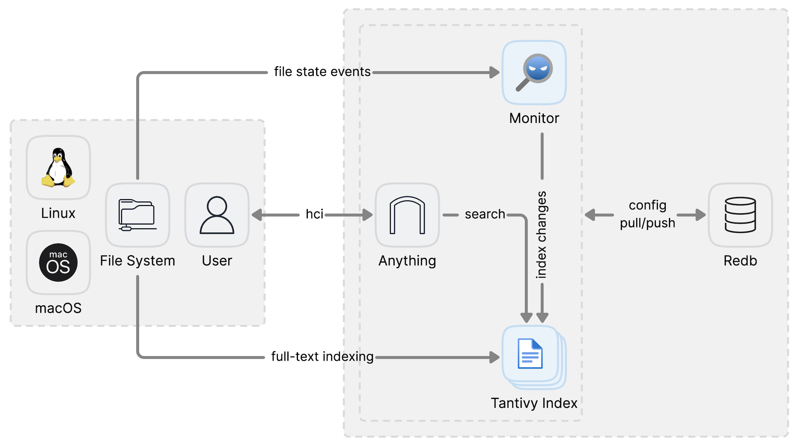

# Anything-rs

This project is currently under active development in early development stage.

## How it works

## TODO List

The following items are currently on our development roadmap:

- [ ] Fix menu name error
- [ ] Fix cols_count
- [ ] Improve UI styling
- [ ] Adjust UI color scheme(Nord Light theme in VSCode)
- [ ] Fix index case sensitivity
- [ ] Add Linux support
- [ ] Add cache for search to avoid repeat searches
- [ ] Add UI for custom included/excluded folders
- [ ] Improve tokenizer
- [ ] Improve search logic
- [ ] Add comprehensive tests
- [ ] Improve performance
- [ ] Fix tantivy-jieba integration issues
- [ ] Seems like it can not delete files in the index properly
